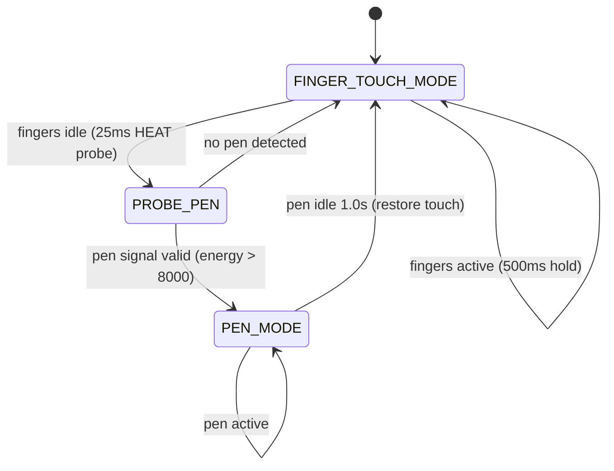

# Pen / Stylus — Surface Pro 11 (Surface Slim Pen 2)

## Hardware

| Component | Details |
| --- | --- |
| Device | Surface Slim Pen 2 (same digitizer as touch) |
| Digitizer | HID-over-SPI, VID `045E`, PID `0C83` |
| Raw data | 68×46 capacitive matrix (HEAT mode) |
| Pressure range | 1–4095 levels |
| Coordinate space | X: 0–9600, Y: 0–7200 |
| Virtual device | `SP11 G6 Virtual Stylus` |
| Physical device | `/dev/sp11-pen` (udev symlink) |

## Problem

The digitizer is a single sensor serving both finger touch and pen input. It cannot produce finger multi-touch and pen tracking simultaneously — they are mutually exclusive modes:

- **Standard HID (`05 00`):** Single-touch finger events
- **HEAT mode (`05 01`):** Raw 68×46 capacitive matrix (no standard HID events)

No kernel driver switches modes automatically. Without a userspace daemon, only one mode works at a time.

## Solution

### Hybrid auto-switching daemon (`sp11-pen-daemon`)

Intelligent mode switching that protects finger multi-touch while providing automatic pen detection.



**How it works:**
1. Default: finger touch mode active, daemon monitors finger activity
2. When fingers idle: 25ms HEAT probe for pen presence
3. If pen detected: switch to full HEAT mode, parse capacitive matrix (weighted centroid → position, signal energy → pressure), emit via uinput
4. After 1s pen inactivity: restore finger touch mode

**Build:**

```bash
cd pen-daemon
gcc -O2 -Wall -o sp11-pen-daemon sp11-pen-daemon.c -lm
```

### udev rule

Matches `001C:045E:0C83.*` kernel name (stable), not `hidrawN` (unstable).

### systemd service

Waits up to 30s for `/dev/sp11-pen`, then starts daemon.

## Installation

```bash
sudo cp udev/99-sp11-pen.rules /etc/udev/rules.d/
sudo udevadm control --reload-rules && sudo udevadm trigger

cd pen-daemon && gcc -O2 -Wall -o sp11-pen-daemon sp11-pen-daemon.c -lm
sudo cp sp11-pen-daemon /usr/local/sbin/ && cd ..

sudo cp systemd/sp11-pen-daemon.service /etc/systemd/system/
sudo systemctl daemon-reload && sudo systemctl enable --now sp11-pen-daemon.service
```

## Verification

```bash
systemctl status sp11-pen-daemon.service   # "FINGER TOUCH MODE active"
ls -la /dev/sp11-pen                        # symlink to /dev/hidrawN
cat /proc/bus/input/devices | grep -A8 "Virtual Stylus"
```

## Files

| File | Purpose |
| --- | --- |
| `pen-daemon/sp11-pen-daemon.c` | Daemon source (553 lines) |
| `udev/99-sp11-pen.rules` | Stable `/dev/sp11-pen` symlink |
| `systemd/sp11-pen-daemon.service` | systemd unit |
